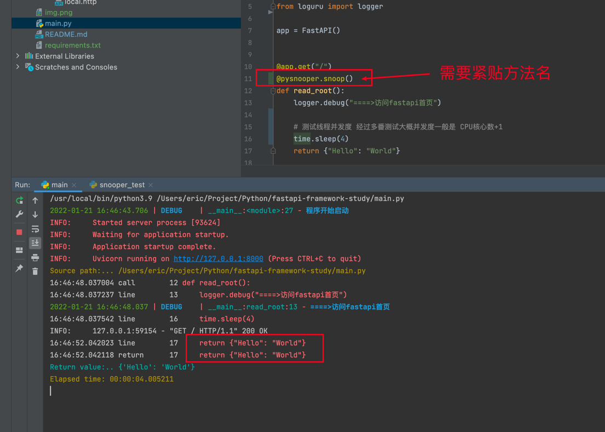

FASTAPI
===


FastAPI framework, high performance, easy to learn, fast to code, ready for production

特色：自动补全

一个完整的框架需要解决的问题。

1. 接收参数，参数的序列化与反序列化的处理，参数的校验
2. service层的处理
3. 数据库的插入操作
4. 全局异常处理


### 
Documentation: https://fastapi.tiangolo.com

中文文档：https://fastapi.tiangolo.com/zh/

Source Code: https://github.com/tiangolo/fastapi

# 组件

技术 | 说明                                                                                      | 官网
----|-----------------------------------------------------------------------------------------|----
fastapi | web server                                                                              | https://fastapi.tiangolo.com/
uvicorn | web容器                                                                                   | https://www.uvicorn.org/
 PySnooper| 调试，展示调用详情                                                                               | https://github.com/cool-RR/PySnooper
ujson | an ultra fast JSON encoder and decoder written in pure C with bindings for Python 3.7+. | https://github.com/ultrajson/ultrajson
Pydantic | 基于标准的 Python 3.6 类型声明                                                                   | https://pydantic-docs.helpmanual.io/
### 安装fastapi

```shell
pip install fastapi
```

```shell
pip install uvicorn
```


### 运行程序
下面这种非常规启动程序与java的war包丢在tomcat里面一样。本质上差不多。而且效果可能更好，可以自动热重启。
```shell
uvicorn main:app --reload
```


#### 热重启

```shell
uvicorn main:app --reload
```

#### main方法运行

下面这种与上面没有本质区别。
```python
    import uvicorn
    uvicorn.run(app, host="0.0.0.0", port=8000)
```
[FastAPI 开始安装(创建第一个例子）多种运行方式](https://blog.csdn.net/qq_40815295/article/details/106896707)
[官网提供这种运行方式](https://fastapi.tiangolo.com/zh/tutorial/debugging/)


### 自带文档

Swagger UI ： http://127.0.0.1:8000/docs#/

或者
 
ReDoc ： http://127.0.0.1:8000/redoc

openapi：http://127.0.0.1:8000/openapi.json


